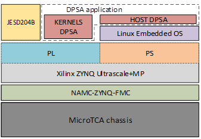

# Hardware acceleration of DPSA using FPGAs
Repository of published article at Sensors 2024, 24(9), 2724; https://doi.org/10.3390/s24092724 

## Abstract

The BC501A sensor is a liquid scintillator frequently used in nuclear physics for detecting fast neutrons. This paper describes a hardware implementation of digital pulse shape analysis (DPSA) for real-time analysis. DPSA is an algorithm that extracts the physically relevant parameters from the detected BC501A signals. The hardware solution is implemented in a MicroTCA system that provides the physical, mechanical, electrical, and cooling support for an AMC board (NAMC-ZYNQFMC) with a Xilinx ZYNQ Ultrascale-MP SoC. The Xilinx FPGA programmable logic implements a JESD204B interface to high-speed ADCs. The physical and datalink JESD204B layers are implemented using hardware description language (HDL), while the Xilinx high-level synthesis language (HLS) is used for the transport and application layers. The DPSA algorithm is a JESD204B application layer that includes a FIR filter and a constant fraction discriminator (CFD) function, a baseline calculation function, a peak detection function, and an energy calculation function. This architecture achieves an analysis mean time of less than 100 μs per signal with an FPGA resource utilization of about 50% of its most used resources. This paper presents a high-performance DPSA embedded system that interfaces with a 1 GS/s ADC and performs accurate calculations with relatively low latency.

## Hardware Requirements

The system is based on a Micro Telecommunications Computing Architecture (MicroTCA) chassis and uses a NAMC-ZYNQ-FMC Advanced Mezzanine Card (AMC) whose main component is a Xilinx ZYNQ Ultrascale + MP SoC. 

## Software Requirements

## Usage

### JESD204B Board Support Package

The JESD204B standard is implemented in the SoC programmable logic (PL) area to interface the digitizer and the DPSA application.

Please, refer to https://github.com/i2a2/namc_zynqup_fmc_bsp/tree/ad_jesd204_2021.1